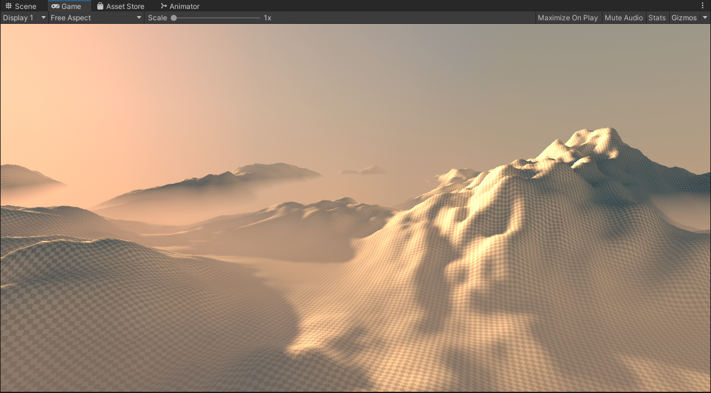
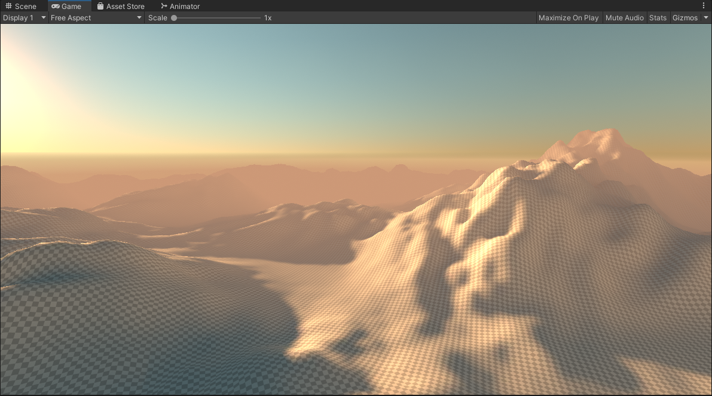
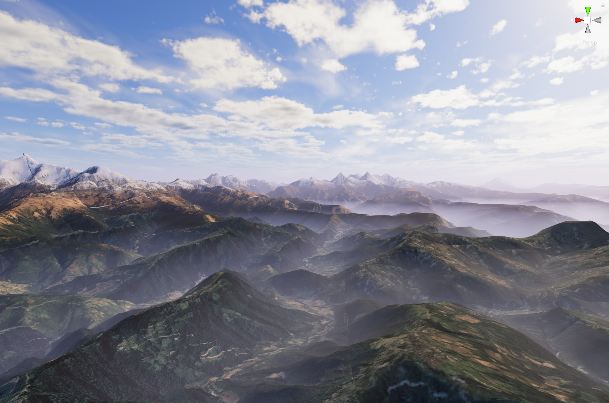
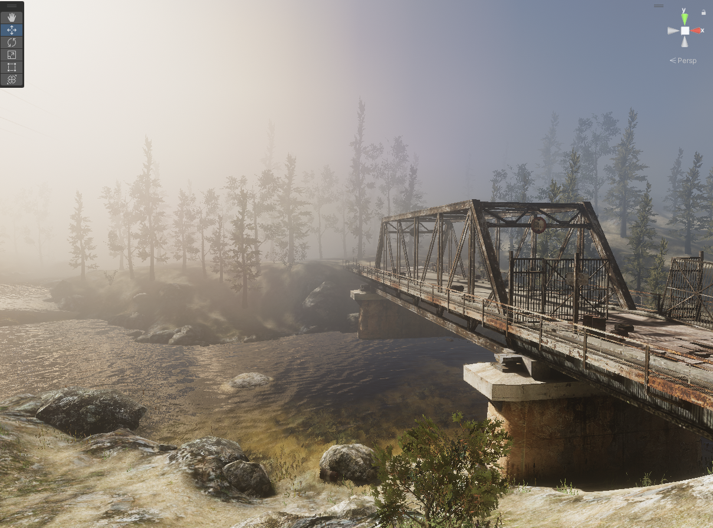
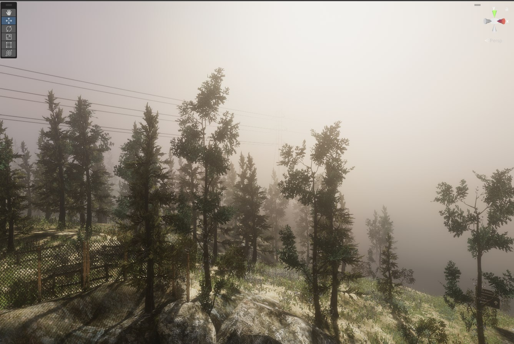
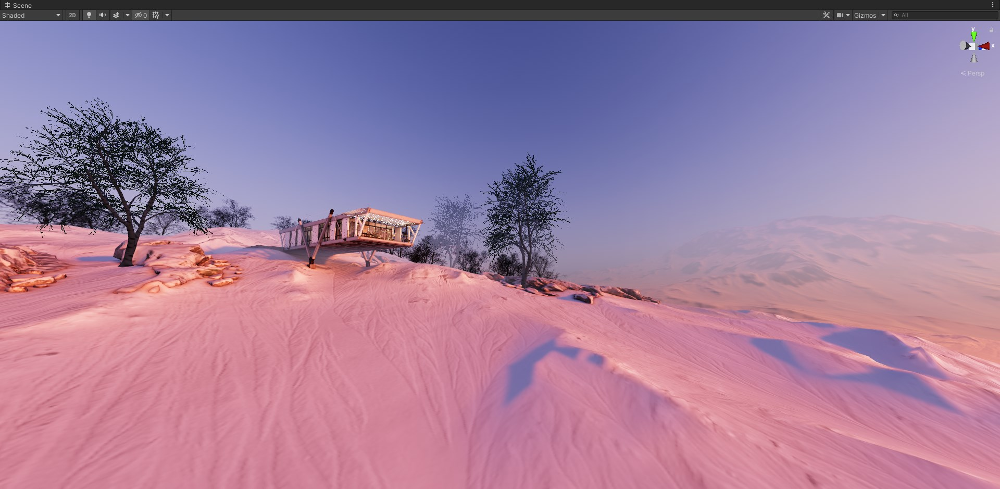

# Unity Cubemap Fog

A simple fog solution that utilizes a cubemap for color, rather than a single constant color for better fidelity. It can do height based fog as well.

**Cubemap Fog On**

**Cubemap Fog Off**

# Results

# Features

- A fog solution using cubemap for color.
- Two versions, post processing version and a scene based version to suit different needs.
- Customizable, height based fog that samples the cubemap at different mip levels for blurring.

**NOTE: Constructed on the Built-In Rendering Pipeline.**

# Notes

Note that unless you are using deffered rendering, the scene based solution requires that there is a camera rendering a camera depth texture. If you don't have access to the main camera properties there are a couple of tricks you can do to enable the rendering of the depth texture in forward rendering.

***Camera Depth Texture Trick 1:*** If that cant be done, a quirk of the post processing stack is that you can enable ambient occlusion which automatically sets off the camera depth texture generation flag and therefore allows this effect to work. If your world doesn't need AO then I suggest putting the quality settings at its lowest so the cost of the AO effect is smaller. The intensity value also needs to be greater than 0 otherwise the effect won't be active.

***Camera Depth Texture Trick 2:***  Courtesy of [orels1](https://github.com/orels1) *(from my baked volumetrics)*, you can make unity enable depth pass without using AO (in case of VRC where you do not have access to adjusting Main Cam properties). All you need is a directional light with shadows enabled hitting some random empty layer - and unity will enable the depth pass for you.
